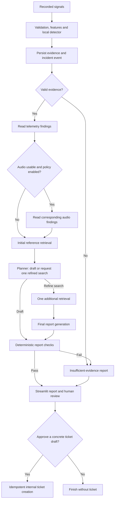

# FabGuard AI — Software-Only Build Specification

**Version 2.0 · 15 September 2026 · Design, not an implementation report**

FabGuard replays recorded bearing signals, detects abnormal conditions, and produces an inspection report with traceable evidence. A user can review the report and approve an internal ticket. Development needs an existing computer and recorded data; no industrial equipment or dedicated edge device is required.

**Release scope:** one dataset, small feature-based models, a Streamlit demo, and a persistent multi-role investigation graph. The release is local. Its central results are bearing-separated detection performance and a measured comparison between fixed and adaptive investigation.

This replaces the earlier platform roadmap. It is a private build specification. Publish a short README based on the implementation and actual results; do not publish this document as proof of completed work.

## 1. Data audit comes first

Use [UORED-VAFCLS version 5](https://data.mendeley.com/datasets/y2px5tg92h/5), whose publisher lists 20 bearings, three recorded states per bearing, and 10-second recordings at 42 kHz. The listed license is CC BY 4.0.

Reconcile the downloaded release with the [dataset paper, sections 2.1 and 3.1–3.4](https://www.researchgate.net/publication/371782379_University_of_Ottawa_constant_load_and_speed_rolling-element_bearing_vibration_and_acoustic_fault_signature_datasets):

- Healthy, inner-race, outer-race, and cage recordings use nominal 400 N load; ball-fault recordings use no applied load.
- Released examples were selected from pools of 50 recordings and checked using FFTs for clean, identifiable fault signals.
- The first five bearings use NSK 6203ZZ; subsequent bearings use FAFNIR 203KD. The published numbering aligns the first five bearings with inner-race faults.

Removing load/manufacturer columns from model inputs does not remove their signatures from vibration or audio. Splitting, normalization, or more windows cannot repair missing combinations of load, manufacturer, and fault type.

### First-session deliverable

Inspect vibration **and audio** immediately. Produce a manifest with bearing ID, health state, eventual fault family, manufacturer, measured load/RPM summaries, channel mapping, units, sample rate, recording hash, and annotation source. Reconcile naming discrepancies against the actual files rather than silently correcting them.

Check alignment, clipping, silence, constant channels, duplicates, duration, and implausible metadata. Plot signals and spectra and listen to safely normalized copies of representative audio. Record technical usability separately from predictive usefulness. No recording is excluded merely because its fault is difficult to recognize.

Freeze exclusion rules and the evaluation configuration before outcome-based model comparisons. Listening and plots are quality checks, not a method of selecting easy test examples.

### Cohorts and claims

| Cohort | Use |
|---|---|
| Bearings 1–10 and 16–20, all three states, after confirming comparable load | Primary healthy-versus-abnormal experiment: 15 bearings |
| Bearings 11–15, including their healthy states | Quarantined from primary fitting/scoring because their fault recordings change load |
| All 20 bearings | Separately labeled confound audit; never the headline fault-detection score |

The primary cohort is provisional until raw metadata agrees. Additional quality exclusions reduce the fold count and must be reported. A load-only diagnostic baseline belongs in the all-data audit to expose the operating-condition shortcut.

There is no headline five-class classifier. Manufacturer and fault family lack the overlap needed to claim manufacturer-independent fault classification. Report binary detection by manufacturer as a descriptive subgroup analysis. Holding out a manufacturer also changes fault-family coverage, so it cannot isolate manufacturer generalization here.

The model card must state: short, selected laboratory recordings; accelerated degradation; load and manufacturer confounding; limited independent bearings; and unverified transfer to other machines. Replaying snapshots does not demonstrate remaining useful life, continuous deterioration, or field false alarms per hour.

## 2. Primary ML protocol

**Task:** healthy versus developing/faulty condition, with developing and faulty recall reported separately. Output an anomaly score and threshold decision, not a causal diagnosis.

### Features and models

Use one-second windows with a half-second hop. The full release yields 19 windows per recording, or **1,140 paired windows across 600 seconds**. The primary cohort yields 855 windows across 450 seconds if all recordings pass validation. Windows overlap; audio does not double the independent sample count.

Start with mean removal, RMS, crest factor, kurtosis, peak-to-peak amplitude, Hann-windowed spectral power, and a small predefined set of band powers. Persist training-fitted scaling. Do not normalize away each recording's amplitude or assign physical fault meanings to spectral peaks without the required metadata.

Compare a robust healthy-reference threshold and Isolation Forest trained only on healthy training examples. A bounded-depth Random Forest is the supervised binary comparator. Declare a small model grid in advance. There is no neural-network training milestone; whether a larger model could win is an empirical question, not a project prerequisite.

### Leave-one-bearing-out evaluation

Use **leave-one-bearing-out (LOBO) cross-validation over the 15 eligible bearings** as the primary protocol, replacing the single 12/4/4 split:

1. Hold out every state and modality of one bearing for the outer test fold.
2. On the remaining bearings, use grouped inner folds to choose preprocessing, model settings, thresholds, and any audio policy. Balance by eventual fault family where feasible; healthy is a state within each bearing, not another bearing family.
3. Select thresholds from inner held-out healthy predictions, then refit on outer-training bearings. The outer bearing never sets its own baseline or threshold.
4. Save out-of-fold predictions, artifact versions, exclusions, and that bearing's metrics.
5. Repeat for each eligible bearing. Report **mean ± standard deviation across bearings**, plus every individual fold.

Report AUROC, average precision, balanced accuracy, actual healthy false-positive rate, and developing/faulty recall. Publish the threshold-selection rule and cohort size. Each binary fold contains both health labels. Multiclass metrics for absent fault families would be undefined and are not computed.

Run a separate **20-fold LOBO confound audit** with all bearings and the load-only comparator. Do not combine its results with the primary cohort. Making all 20 the headline protocol would reintroduce the load problem.

Cross-validation does not create equipment diversity. Fold standard deviation is descriptive, not a confidence interval; training folds overlap. Keep all tuning inside the inner evaluation. Do not repeatedly adjust models against outer-fold results.

### Audio decision

Audit audio in the first session. Test vibration-only, audio-only, and a simple feature-combination model on identical outer folds. Select fusion/evidence-use policies inside inner folds; publish all comparisons. Alignment or an audible difference alone does not establish improved detection.

If audio is unusable, deliver vibration-only and report the failed audit. If useful only on a subset, report coverage. The investigation may use it only under the declared quality/policy gate, with missingness and disagreement visible. Do not call the delivered project multimodal unless usable paired evidence actually contributes.

## 3. One sequential investigation graph

This is a **multi-role investigation graph** with typed tools and one configured LLM. Roles describe responsibilities, not independent autonomous agents. There is no parallel fan-out or open-ended ReAct supervisor.



Availability, quality, budgets, and approval are deterministic checks. The meaningful LLM choice is whether current passages answer a specific unresolved evidence question and, if not, what refined retrieval query could resolve it. The planner must name the question and justify the query. It cannot invent modalities, histories, tools, or machine actions.

### Execution contract

| Role/node | Limit and state ownership |
|---|---|
| Telemetry reader | Once; writes `telemetry_findings` |
| Audio reader | At most once; writes `audio_findings` |
| Initial retrieval | Once; writes `initial_passages` |
| Planner | Once; writes `decision`, `question`, `query`, and `initial_draft` |
| Refined retrieval | At most once; writes `refined_passages` |
| Final generator | At most once; writes `final_draft` |
| Verifier | Once; writes verification result and terminal report |

Use `add_conditional_edges` with a single destination per decision. Each node updates only its owned fields. No two writers run in one superstep, so append reducers and dynamic `Send` dispatch are unnecessary. Adding parallel execution would require a new state/reducer design and join tests. [LangGraph graph API](https://docs.langchain.com/oss/python/langgraph/graph-api).

Maximum work: **two retrievals and two logical LLM calls**. Each LLM call may retry once for a transient transport failure, giving four maximum provider attempts. Invalid structured output fails closed without a repair loop. Apply an initial configurable 120-second run deadline, per-call timeouts, and a separate defensive recursion limit. These are limits to test, not latency achievements.

## 4. Persistence and recovery

Run a replay script, FastAPI, one synchronous investigation worker, PostgreSQL/pgvector, and Streamlit. The UI calls the API; page reruns do not directly launch investigations. Raw evidence and model artifacts stay on disk behind opaque IDs.

PostgreSQL holds incidents, event leases, reports, approvals, and **graph checkpoints**. Compile the graph with `PostgresSaver` from `langgraph-checkpoint-postgres`, initialize its schema once, and set `thread_id` to the stable incident UUID. Use synchronous checkpoint durability. Resume failures from the same thread and saved state, without reinitializing the graph. [Checkpointer behavior](https://docs.langchain.com/oss/python/langgraph/checkpointers).

Keep delivery state and graph-run state separate. Serialize each incident using a database advisory lock as well as the event lease. A worker that loses its lock/connection must stop. Pin graph, prompt, evidence, and model versions. A fresh investigation revision is an explicit request with reset node outputs under that incident, not an accidental retry of completed work.

Each external call occupies its own node; persist its output before advancing. Computed evidence uses deterministic artifact keys; events and tickets use unique keys. Saved checkpoints avoid redoing completed calls. A crash after a provider accepted a request but before its response was persisted can still cause a duplicate paid call; checkpointing cannot guarantee exactly-once billing.

**Recovery checks:** kill the worker after a saved retrieval, after a saved LLM result, and during an uncommitted provider call. Restart and verify the resume position, preserved evidence, and repeat-call behavior. Duplicate events must not create another incident; duplicate approvals must not create another ticket.

Approval is an API transaction after graph completion. Bind the reviewer, incident, draft revision, and action. A changed draft invalidates old approval; model output cannot approve anything.

## 5. Retrieval and report contract

Use three to five manually checked bearing references with page/section provenance. Ingest them into PostgreSQL full-text search and pgvector. Fix retrieval settings on development cases before held-out evaluation. Label general bearing guidance as general; access does not automatically grant redistribution rights.

Every report separates:

- **Observation:** measured feature, recording window, and processing version.
- **Prediction:** abnormality score, threshold, model, and evaluation scope.
- **Hypothesis:** possible interpretation, including conflicting or missing evidence.
- **Guidance:** a cited applicable passage and a proposed inspection or request for information.

Check source IDs, artifact ownership, applicability metadata, numeric consistency, and schemas in code. Assess semantic citation support using the reviewed rubric; these checks do not guarantee engineering correctness. Missing support produces abstention. Do not infer root cause from a fault label, fabricate history, invent inspection deadlines, or generate diagnosis-confidence percentages.

Runtime evidence exposes opaque recording IDs, sample offsets, modality quality, features, model versions, and references. Ground truth, label-bearing filenames, and split identities stay in the evaluator. Load/manufacturer metadata supports applicability and auditing, not the signal detector or an assertion of fault.

Uploaded/retrieved content is untrusted data. Test document prompt injection, invalid signals, artifact-path traversal, unauthorized approval, stale revisions, duplicate delivery, and provider outages. The application has no equipment-control tool.

## 6. Prove whether adaptive investigation helps

Run a paired **fixed-pipeline versus adaptive-graph ablation**:

| Variant | Behavior |
|---|---|
| A: fixed baseline | Same quality/audio gates, one initial retrieval, one LLM report, same verifier |
| B: adaptive graph | Same inputs and initial retrieval; planner may request one refined search and final report |

Use the same model, corpus, retrieval settings, evidence permissions, report schema, and output-token limit per generation. Count B's extra calls and cost. Persist both variants so recovery benefits are not confused with routing benefits.

Author **15 investigation cases**: supported observations (3), missing/invalid evidence (3), modality disagreement (2), retrieval failure (2), malicious documents (2), unsupported causal claim (1), ambiguous request (1), and a normal recording (1). Use five for development and freeze ten for evaluation. Tag authored scenarios and reference answers as workflow fixtures, not industrial maintenance ground truth.

Run both variants on the same ten held-out cases, three times each. Score blinded outputs against a fixed checklist: correct evidence use, supported guidance, required abstention, and no unauthorized action. Report per-case success, unsupported claims, retrievals, LLM attempts, tokens, cost, and latency. Repeated runs measure variability, not additional independent cases.

**Adoption rule:** enable adaptive retrieval by default only if it passes at least two additional cases under majority-of-three scoring, introduces no new unsupported-action/approval failures, and keeps median cost at or below 1.5× baseline. Otherwise ship the fixed variant and publish the negative result. This is a predeclared engineering rule, not a statistical significance claim.

Crash/retry and authorization tests are separate deterministic checks; they do not require more manually labeled investigation cases.

## 7. Demo and reproducibility

Use three Streamlit views: **Replay**, **Incident**, and **Results**. Show provenance, waveform/spectrum, model output, tool trace, citations, and ticket preview. Put primary results before architectural detail. Label recorded-data replay and synthetic fixtures throughout.

The API only needs event ingestion, incident retrieval/investigation, and ticket-draft approval. Jobs, reports, and approvals persist across page refreshes.

Track experiments in run directories containing `config.json`, data/split hashes, dependency lock, seed, Git revision, `metrics.json`, per-bearing predictions, plots, and a summary `results.csv`. No tracking service is needed. Keep large data and models outside Git.

Benchmark the chosen native CPU pipeline at batch size one, declaring processor, runtime, threads, warm-up, and repetitions. Report P50/P95 model-only and preprocessing-plus-model latency and memory. Include the one-second window in alert-delay discussions. Laptop measurements are not physical edge-device benchmarks.

The public README should fit roughly one page: what runs, reproduction steps, a results table, main limitations, and a demo link. Describe actual decisions and failures in the author's own words after implementation. Avoid employer-specific framing, unearned platform claims, and promised interview outcomes.

## 8. Bounded implementation plan

The commitment is the local release. There is no cloud rollout or deferred feature catalog. New infrastructure would compete directly with data and investigation evaluation.

| Milestone | Effort estimate | Completion evidence |
|---|---:|---|
| Data and audio audit | 6–10 h | Manifest, confound table, exclusions, quality plots |
| DSP and grouped ML evaluation | 16–24 h | Primary LOBO results and separate confound audit |
| Replay, API, storage, Streamlit | 8–12 h | Durable incident visible end to end |
| Retrieval and persistent graph | 12–18 h | Cited report, bounded routing, checkpoint resume |
| Ablation and failure checks | 12–18 h | Paired comparison, crash and approval checks |
| Packaging and demo | 4–6 h | Reproduction instructions, model card, actual results |
| **Subtotal** | **58–88 h** | |
| **With 25% contingency** | **73–110 h** | Rounded upward |

The earlier conversation assumed 3–4 hours per day. At five days/week, that is 15–20 hours/week: allow approximately **4–8 weeks**, not a promised six-week full platform. Availability is an assumption, not a confirmed commitment. Re-estimate after the first two milestones. Six weeks at 15 hours/week permits 90 hours; freeze scope and use the fixed variant if adaptive retrieval fails its adoption rule. Do not drop the audit, grouped evaluation, ablation, or recovery checks to make the demo look finished.

Stop criteria: unusable audio means vibration-only; weak results remain visible; no adaptive benefit means the fixed variant is the default. A documented failed hypothesis is a valid result.

## 9. Repository and first action

Use a separate FabGuard repository when coding begins. This revision changes the specification only.

```text
fabguard-ai/
├── README.md
├── pyproject.toml
├── compose.yaml
├── src/fabguard/
│   ├── data.py           # Audit, cohorts and folds
│   ├── signals.py        # Vibration/audio features and quality
│   ├── train.py          # Baselines and nested evaluation
│   ├── replay.py         # Recorded-data runner
│   ├── retrieval.py      # Documents, search and provenance
│   ├── graph.py          # Sequential nodes, routing and checkpoints
│   ├── api.py            # Incidents and approval transactions
│   ├── worker.py         # Claims, incident locking and resume
│   └── storage.py        # Database and artifact references
├── app.py                # Streamlit demo
├── configs/              # Frozen experiment settings
├── manifests/            # Identities, exclusions and folds
├── evals/                # 15 workflow cases and split
├── tests/                # Integrity, recovery and permissions
├── reports/              # Results, ablations and model card
└── runs/                 # Ignored experiment/model artifacts
```

**First action:** audit raw load, manufacturer, identity, vibration, and audio fields together. Produce the primary-cohort manifest before training or building the dashboard. The raw-file audit and all model/runtime results remain to be performed; literature verification supports this design but does not replace those checks.
